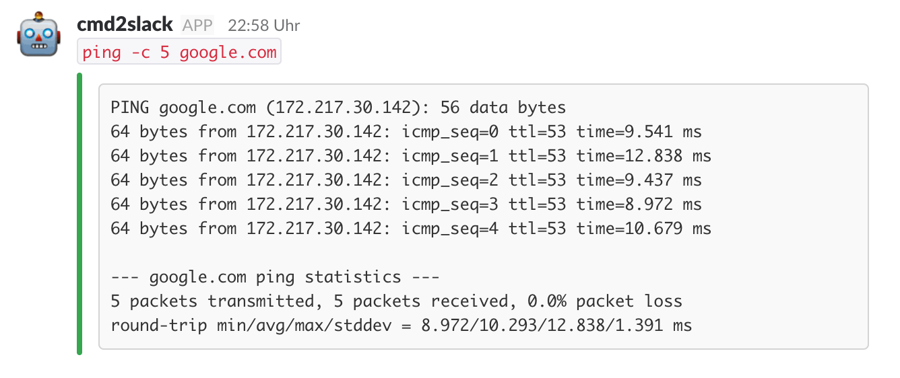
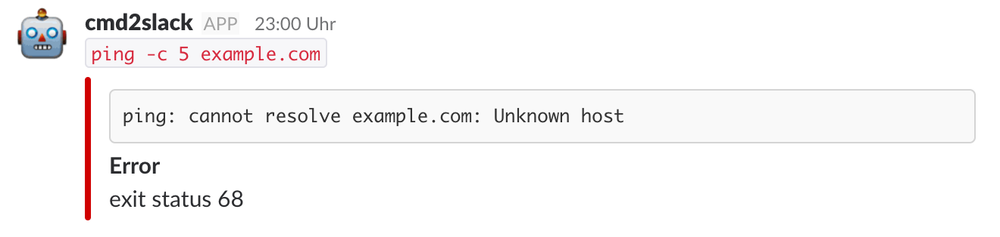

# cmd2slack - Execute a command and send its output to Slack

Execute a command and send its `stdout` and `stderr` to a Slack channel as an [Incoming Webhook](https://api.slack.com/incoming-webhooks).

## Usage
First you need to set up an [incoming webhook integration](https://my.slack.com/services/new/incoming-webhook/) in your Slack workspace. Once done that, you will receive a webhook URL (`$HOOK` hencefort). That's all the configuration you need.

Once you have your webhook URL, just call your command prefixed by `cmd2slack`, like in the following example:

```
$ cmd2slack -hook $HOOK ping -c 5 google.com
```

If the invocation was successful, you will receive a message like this:



If the command executed exits with a failure code, the message will look like this:



The are also additional flags you can pass the program:

```
$ cmd2slack --help
Usage of cmd2slack:
  -channel string
        Channel where to post the output
  -emoji string
        Emoji to use
  -hook string
        Slack Incoming Webhook URL
  -icon string
        URL of icon to use
  -timing
        Include command execution timing
  -username string
        Username
  -verbose
        Show command execution on screen
```

## Installation
If you have a running Go environment, just do

```
go install github.com/inkel/cmd2slack
```

If you prefer instead downloading precompiled binaries, you can find them in the [releases](https://github.com/inkel/cmd2slack/releases) section. Just download the version you're looking for, place it in your `$PATH` and make it executable. Enjoy!

## License

MIT. See [LICENSE](LICENSE).
